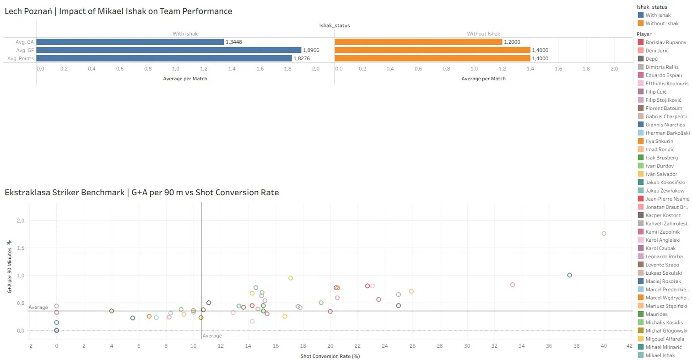

# Ekstraklasa Striker Benchmark & Ishak Impact Analysis

A data scouting project analyzing striker performance across the Ekstraklasa 2025/26 season.

**Key question: How does Mikael Ishak's absence affect Lech Poznań's attacking output?**

## Key Findings

| Metric | With Ishak | Without Ishak |
|--------|-----------|---------------|
| Avg. Goals Scored | 1.90 | 1.40 |
| Avg. Points per Game | 1.83 | 1.40 |
| Loss Rate | 13.8% | 40.0% |

Lech Poznań lose **3x more often** without Ishak in the starting lineup.

## Tech Stack
- Python (Pandas) — data cleaning, merging, feature engineering
- Tableau — interactive dashboard and visualization

## Data Source
All raw data sourced from [FBref](https://fbref.com) — Ekstraklasa 2025/26 season.